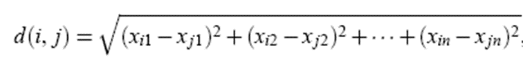
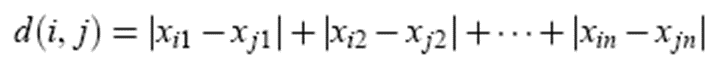
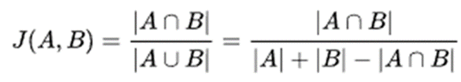
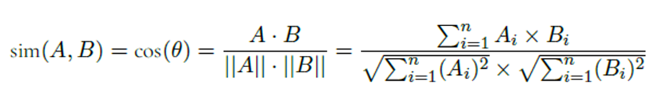
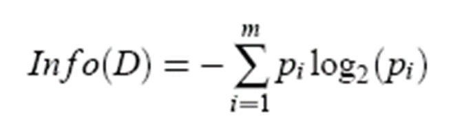
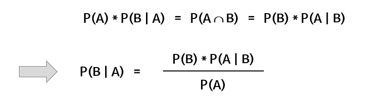
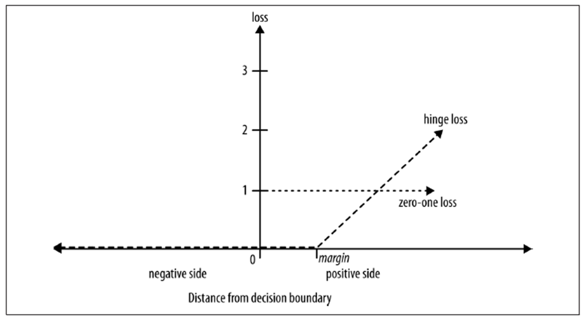

# 데이터 과학 개론

## Self-Assessment

1. Overfitting이 무엇인지 설명할 수 있다.

2. Training / Validation / Test / Score Data의 역할을 설명할 수 있다.

3. Confidence, Support, Lift를 계산할 수 있다.

4. Supervised / Unsupervised Learning의 차이를 설명할 수 있다.

5. Loss Function이 무엇인지 설명할 수 있다.

6. Euclidean Distance와 Cosine Distance의 차이를 설명 할 수 있다.

7. Softmax Function을 계산할 수 있다.

8. Mini batch와 Epoch의 관계를 설명할 수 있다.

9. F1-Score가 무엇인지 알며 계산할 수 있다.

10. TF-IDF가 무엇인지 설명할 수 있다.

11. LDA가 어디에 사용되는지 알고 있다.

12. Word2vec이 무엇을 위한 알고리즘인지 알고 있다.

## Topics to be covered

1. Learning / Inference (Scoring)

2. Learning Types: Supervised / Unsupervised

3. Knowledge Types: Association / Clustering / Classification

```
Association: 연관 규칙으로 조합을 통해 규칙을 찾아내는 것

Clustering: 여러 개체를 유사도에 따라 그룹화 하는 것

Classification:  각 객체의 특정 속성(변수)에 레이블을 붙이는 것
```

4. Normalization

- Z-score 표준화

$Z_{i} = \frac{x_i - \bar{x}}{s}$

- Min/Max 정규화

$(-\infin ~ +\infin)$의 범위를 갖는 값을 (Min ~ Max) 사이의 값으로 정규화

$v^{'} = \frac{v- min_A}{max_A - min_A} (new max_{A} - new min_A) + new min_{A}$

예) 최소 / 최대 연봉이 ($30,000 ~ $80,000) 일 때, 이를 (0~1)로 정규화하고자 한다.

이 때, $40,000을 정규화한 결과는?

$\frac{40000 - 30000}{80000 - 30000} = \frac{10000}{50000} = 0.2$

5. Missing Value, Outlier

- Outlier(IQR)

```
Q_1, Q_2, Q_3 기준으로 (Q_1 - 1.5 X IQR) ~ (Q_3 + 1.5 X IQR) 사이의 값만 사용

자료의 수가 홀수인 경우 -> 가운데 위치한 값

자료의 수가 짝수인 경우 -> 가운데 위치한 두 값의 평균
```

6. Confidence, Support, Lift

- Support

```
절대 지지도: COUNT(A)

상대 지지도: COUNT(A) / COUNT(TOTAL)
```

- Confidence

```
COUNT(A 합집합 B) / COUNT(A)
```

- Lift

```
LIFT(A -> B)
SUPPORT(A 합집합 B) / SUPPORT(A) SUPPORT(B)

- SUPPORT(A 합집합 B): COUNT(A 합집합 B) 
- SUPPORT(A) : COUNT(A) / COUNT(TOTAL)
- SUPPORT(B) : COUNT(B) / COUNT(TOTAL)
```

7. Apriori Algorithm

```
1. Frequent Itemset은 Relative Support > Minmum Support Threshold를 찾는 과정인데, Apriori Algorithm은 Frequent Itemset을 효율적으로 찾는 알고리즘

2. 필요하지 않은 것은 조합을 살펴보지 않고 건너 뜀

3. Join Step과 Prune Step으로 구성됨

4. Join step은 k개의 item을 포함한 itemset을 만드는 과정

5. Prune step은 Join Step에서 만들어진 Frequent Itemset에서 없는 애들을 찾아서 지운다.
```

8. Minkowski Distance (Euclidean, Manhattan)


- Euclidean Distance (L2)



- Manhattan Distance



9. Jaccard Distance

집합 간 유사도 측정에 사용



10. Cosine Distance

두 벡터가 가리키는 방향이 얼마나 유사한지 측정 (벡터 크기와 무관)

```
1. 방향이 완전히 일치하면 1, 완전히 반대이면 -1
2. 벡터의 모든 원소가 양수라면, 코사인 유사도의 최소값은 0
3. 문서 간 유사도 측정에 주로 사용 (문서는 문서에 출현한 단어들의 벡터로 나타남)
```



Why Cosine?

```
1. 유사도 기준으로 내적을 사용한다면 -> 벡터의 방향과 크기를 고려하는 것
2. 유사도 기준으로 코사인 값을 사용한다면? -> 벡터의 방향만을 고려하는 것
3. 코사인 유사도 -> 문서의 길이가 다르기 때문에 문서 벡터의 내적을 벡터의 크기로 정규화하는 의미
```

11. Hierarchical Method - Dendrogram

거리 기준을 통해 Distance Matrix로 부터 덴드로그램을 구축

```
클러스터 간 거리 기준(Linkage)은 Single Linkage(최소 거리), Complete Linkage(최장 거리), Average Linkage(평균 거리), Centroid Linkage(중앙 거리)가 있음.
```

Ward's Linkage

```
클러스터의 Centroid와 각 객체의 오차제곱함을 구함

임의의 두 클러스터를 통합하고, 통합 클러스터의 Centroid를 구함

통합된 클러스터에서 새 Centroid와 각 객체의 SSE를 구함

SSE의 증분이 작을 수록 -> 가까운 클러스터임을 의미
```

12. Density-based Method - DBSCAN

```
객체에서 반지름 내에 위치한 객체의 집합

Core Object: 정해진 개수보다 많은 neighborhood를 갖고 있는 객체
```

13. Partitioning Method - K-Means

```
1. Step 0 : 목표 클러스터의 수 지정 -> k
2. Step 1 : k 개의 객체를 임의로 선정 -> k개 클러스터의 초기 중심
3. Step 2 : 전체 객체에 대해, 각 객체를 위의 k개 클러스터 중 하나에 배정
- 객체와 클러스터 중심 간 거리가 가장 가까운 클러스터에 배정
- Hard Clustering

4. Step 3 : k 개 클러스터의 중심을 갱신함
- 클러스터에 속한 전체 객체의 평균 (mean)을 새로운 중심으로 사용함

5. Step 4 : 위의 Step 2와 Step 3을 반복 수행함
- 클러스터에 더 이상 변화가 발생하지 않으면 종료
```

Issues

```
1. 클러스터의 수 k를 어떻게 설정할 것인가?
2. 초기 중심으로 사용할 seed 객체는 어떻게 선정할 것인가?
3. Mean이 Noise와 Oulier에 취약하다는 한계를 어떻게 극복할 것인가?
- K-Medoids Algorithm
```

14. Infiormation Gain

엔트로피는 무질서도를 의미한다. Information Gain은 특정 집합에 대한 무질서도를 의미한다.




15. Undersampling, Oversampling

Highly Imbalanced Data에 대해 Undersampling, Oversampling, Combined Over- and Under-Sampling 등이 존재

```
Undersamping: Majority 데이터의 일부만 사용

Oversampling: Minority 데이터를 증가시켜서 사용

Combined Over- and Under-Sampling: 두 가지 방법의 결함
```

16. Naive Bayesian Classifier

```
1. 베이지안 이론은 두 확률 변수의 사전 확률과 사후 확률 사이의 관계를 나타냄
2. 불확실성 하에서 의사결정 문제를 다룰 때 사용
```



Naive Bayesian Classifier은 베이지안 정리를 사용하여 주어진 데이터가 속할 확률이 큰 클래스로 해당 데이터를 분류

17. Obejct Function

```
손실 함수(Loss Function): 개별 데이터의 예측 오차 측정 ex) 제곱 오차(Squared Error), 절대 오차(Absolute Error) 등

비용 함수(Cost Funciton): 전체 데이터의 예측 오차 측정 ex) MSE(Mean Squared Error) 등

목적 함수(Object Function): 모델이 최적화하고자 하는 값 ex) 절대 오차 혹은 제곱 오차의 평균을 최소로 하는 값
```

18. Odds Function, Logistic Function (Sigmoid)

- Odds Funciton

성공 확률이 실패 확률의 몇 배인지를 나타냄

```
ex) (성공, 실패) 확률이 각각 (0.8, 0.2)라면 -> (Odds Ratio = 4)

성공 확률이 p(x) 라면 -> 실패 확률은 1 - p(x)

Odds Ratio = p(x) / (1 - p(x))
```

- Logistic Function

독립 변수의 선형 결합으로 종속 변수를 설명하며, 일반적으로 이항형 문제(Binary Decision)의 해결에 사용

셋 이상의 클래스를 갖는 경우 다항 로지스틱 회귀 사용

Odds Ratio에 대한 Logit 변환을 통해 함수 도출 (로짓 변환: $log((\frac{y}{(1-y))}))$로 만드는 변환

19. Soft Margin SVM

Hard Margin SVM의 경우, 모든 샘플을 마진 바깥쪽으로 분류해야 하고, 이상치에 민감하다.

일부 데이터들이 분류 경계면 반대쪽에 존재하는 것을 허용할 필요가 있는데, Soft Margin SVM은 일부 데이터 들이 분류 경계면 반대쪽에 존재하는 것을 허용한다.

Margin Violation(위반)을 얼마나 허용할 것인가?

```
Regularization 파라미터 C(Cost) 설정으로 

C 값이 클수록 마진 오류를 덜 허용 -> 마진 폭 좁아짐

C값이 작을수록 마진 오류를 더 허용함 -> 마진 폭 넓어짐
```

20. Hinge Loss

모든 데이터가 정확하게 분류 될 수는 없음 -> 오분류 데이터에 대한 Loss 평가가 필요

이 때, Hinge Loss 적용 (일반적으로는 Zero-One Loss 적용)



21. Dot Product & Matrix Multiplication

22. Multi-layer Perceptron

23. Activating Function

24. Softmax Function

25. Loss Function, Cross Entropy Error

26. Mini batch, Epoch

27. Accuracy vs Coverage

28. Misclassification Rate / Mean Squared Error

29. Confusion Matrix

30. F1 Score

31. POS Tagging in Text Analytic

32. WordNet

33. Co-occurrence Matrix

34. Vector Space Model (Doc./Term Matrix)

35. Cosine Similarity

36. Word Cloud

37. CBOW / Skip-gram

38. Word Similarity

39. Analogy

40. LDA

41. CNN

42. RNN & LSTM
